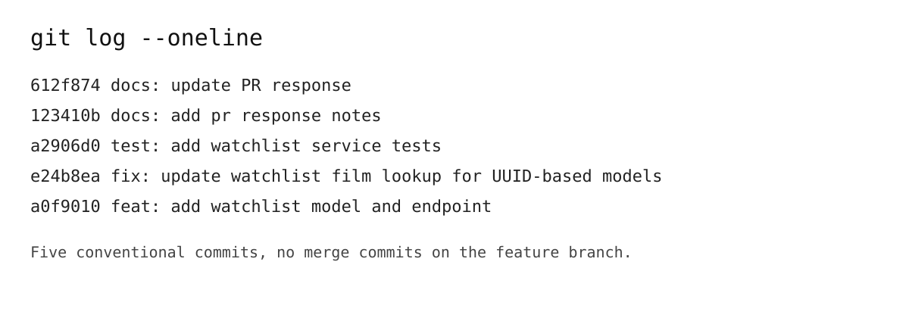

# PR Response

## AI Usage
I used GitHub Copilot as a coding assistant during this project to help with codebase orientation and to sanity-check implementation ideas. For example, I asked it to explain the existing watchlist/collection patterns in the repository so I could mirror the project’s conventions before writing the new service and routes. I also used it to stress-test my reasoning about the visibility default and sort order decisions, but the final design choices were made by me after reviewing the existing model and tests.

## Comment 1 — Watchlist feature overview
I added a watchlist feature that lets a user save films for later and view them through a dedicated endpoint. The implementation includes a new watchlist entry model, a service layer for saving and retrieving entries, and routes for adding a film and fetching the watchlist for a specific user.

## Comment 2 — Collection pattern alignment
I followed the collection feature’s structure as the main pattern for this work. The watchlist service mirrors the collection service’s flow for creating entries and raising a clear domain error when a film is missing, while the route layer keeps the API shape simple and consistent with the existing application structure.

## Comment 3 — Visibility default and sort order
I made two explicit design decisions in the watchlist implementation:
- Visibility default: new watchlist entries default to public=True so the feature is immediately useful for sharing or future expansion without requiring an extra update step.
- Sort order: watchlist results are returned newest-first by date_added, which makes the most recently saved films appear at the top and feels natural for a “save for later” list.

## Comment 4 — Testing strategy
I added service-level tests that cover the core behavior of the watchlist feature. The tests verify that a valid film creates a watchlist entry, that duplicates are rejected with a dedicated error, that missing films raise the expected exception, and that the returned watchlist is ordered newest-first.

## Comment 5 — UUID compatibility and rebase
The rebase issue was resolved by making the watchlist implementation fully compatible with the UUID-based film model introduced on main. I updated the service to look up films using UUIDs with db.session.get(Film, film_id), kept the route input as a UUID string, and adjusted the tests so the feature works correctly with the new model.

## Comment 6 — Rebase process
I fetched the updated main branch and rebased feature/watchlist onto it with:
```bash
git fetch origin
git rebase origin/main
```
The main conflict area was the shift from integer film IDs to UUIDs. I resolved it by ensuring the watchlist code and tests use UUID-based film IDs consistently. I confirmed the rebase was fully addressed by running the test suite with pytest -q and verifying that the branch history no longer contains merge commits.

## PR Description
This PR adds a watchlist feature to CineLog. Users can save films to a personal watchlist, view the films they have saved, and keep the list organized through the application’s existing Flask patterns. I made two design decisions explicitly: new watchlist entries default to public visibility, and the watchlist is returned in newest-first order by date_added.

Manual testing steps:
1. Start the Flask app and create or identify a user and a film record.
2. Send a POST request to /watchlist/<user_id>/add with a JSON body containing a valid film_id to add a film to the watchlist.
3. Send a GET request to /watchlist/<user_id> to confirm the film appears in the returned watchlist.
4. Add a second film and confirm the list is sorted with the most recently added film first.
5. Attempt to add the same film twice and confirm the API raises the duplicate-entry error.
6. Try adding a non-existent film_id and confirm the service raises the expected not-found error.

## Commit History Screenshot


